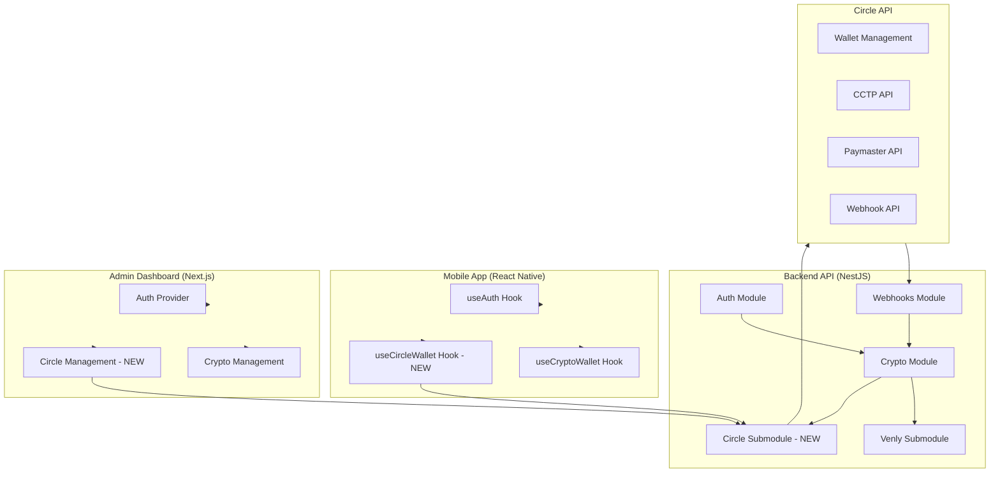

# Circle Integration Implementation Plan

## Overview

This plan outlines the implementation of Circle's blockchain APIs as a separate, independent system alongside the existing Venly integration. The implementation will follow NestJS best practices, maintain separation of concerns, and support gradual migration from Venly to Circle.

## Architecture Overview



## Implementation Phases

### Phase 1: Backend Foundation

#### 1.1 Database Schema Updates

**File:** `apps/raverpay-api/prisma/schema.prisma`

- Add `CircleUser` model to store Circle entity information
- Add `CircleWallet` model (separate from Venly wallets) with fields:
  - `circleWalletId` (Circle's wallet ID)
  - `walletSetId` (Circle wallet set ID)
  - `address` (blockchain address)
  - `blockchain` (e.g., "MATIC-AMOY", "ETH-SEPOLIA")
  - `accountType` (SCA or EOA)
  - `state` (LIVE, PENDING, etc.)
- Add `CircleTransaction` model for tracking Circle transactions
- Add `CircleWebhookLog` model for webhook processing
- Update `Wallet` model to add optional `circleWalletId` field (for backward compatibility)

#### 1.2 Circle Module Structure

**Directory:** `apps/raverpay-api/src/circle/`

Create the following structure:

```
circle/
├── circle.module.ts
├── circle.controller.ts
├── circle.service.ts
├── config/
│   └── circle.config.service.ts
├── entity/
│   ├── entity-secret.service.ts
│   └── entity-secret.types.ts
├── wallets/
│   ├── circle-wallet.service.ts
│   ├── wallet-set.service.ts
│   └── circle-wallet.types.ts
├── transactions/
│   ├── circle-transaction.service.ts
│   ├── cctp.service.ts
│   └── circle-transaction.types.ts
├── paymaster/
│   └── paymaster.service.ts
├── webhooks/
│   ├── circle-webhook.controller.ts
│   ├── circle-webhook.service.ts
│   └── circle-webhook.types.ts
├── compliance/
│   └── address-screening.service.ts
├── dto/
│   ├── create-circle-wallet.dto.ts
│   ├── transfer-usdc.dto.ts
│   ├── cctp-transfer.dto.ts
│   └── index.ts
└── cron/
    ├── circle-balance-sync.cron.ts
    └── circle-transaction-sync.cron.ts
```

#### 1.3 Core Services Implementation

**Circle Config Service** (`circle/config/circle.config.service.ts`)

- Load Circle API key from environment variables
- Manage API base URLs (testnet vs mainnet)
- Entity secret encryption/decryption utilities
- Public key management

**Entity Secret Service** (`circle/entity/entity-secret.service.ts`)

- Generate and encrypt entity secrets
- Store encrypted entity secrets securely
- Rotate entity secrets
- Re-encrypt entity secret ciphertext for API calls

**Circle Wallet Service** (`circle/wallets/circle-wallet.service.ts`)

- Create wallet sets
- Create developer-controlled wallets
- Retrieve wallet details and balances
- Update wallet metadata
- List wallets with filters

**Circle Transaction Service** (`circle/transactions/circle-transaction.service.ts`)

- Create USDC transfer transactions
- Get transaction status
- Cancel transactions
- Accelerate transactions
- Estimate fees

**CCTP Service** (`circle/transactions/cctp.service.ts`)

- Initiate cross-chain transfers
- Fetch attestations from Circle
- Mint USDC on destination chain
- Track transfer status

**Paymaster Service** (`circle/paymaster/paymaster.service.ts`)

- Configure paymaster for transactions
- Handle USDC allowance/permit signing
- Estimate gas fees in USDC
- Process gasless transactions

**Circle Webhook Service** (`circle/webhooks/circle-webhook.service.ts`)

- Verify webhook signatures
- Process transaction notifications
- Handle wallet state changes
- Update database records

#### 1.4 API Client Setup

**File:** `apps/raverpay-api/src/circle/circle-api.client.ts`

- Create Axios instance with Circle API base URL
- Add authentication headers (Bearer token)
- Implement request/response interceptors
- Error handling and retry logic
- Idempotency key generation

#### 1.5 Controller Implementation

**File:** `apps/raverpay-api/src/circle/circle.controller.ts`

Endpoints:

- `POST /circle/wallets` - Create Circle wallet
- `GET /circle/wallets` - Get user's Circle wallets
- `GET /circle/wallets/:id` - Get wallet details
- `GET /circle/wallets/:id/balance` - Get wallet balance
- `POST /circle/transactions/transfer` - Transfer USDC
- `POST /circle/transactions/cctp` - Cross-chain transfer
- `GET /circle/transactions/:id` - Get transaction status
- `POST /circle/transactions/:id/cancel` - Cancel transaction
- `POST /circle/transactions/:id/accelerate` - Accelerate transaction
- `POST /circle/webhooks` - Webhook endpoint (public, signature verified)

### Phase 2: Mobile App Integration

#### 2.1 Circle API Client

**File:** `apps/raverpaymobile/src/lib/api/circle-api.ts`

- Create API client for Circle endpoints
- Add endpoints to `endpoints.ts`
- Handle authentication headers
- Error handling

#### 2.2 Circle Hooks

**Directory:** `apps/raverpaymobile/src/hooks/`

**File:** `useCircleWallet.ts`

- `createCircleWallet()` - Initialize Circle wallet
- `getCircleWallets()` - Fetch user's Circle wallets
- `getCircleWalletBalance()` - Get USDC balance
- `transferUSDC()` - Send USDC transfer
- `cctpTransfer()` - Cross-chain transfer

**File:** `useCircleTransactions.ts`

- `getCircleTransactions()` - List transactions
- `getCircleTransaction()` - Get transaction details
- `cancelTransaction()` - Cancel pending transaction

#### 2.3 UI Components

**Directory:** `apps/raverpaymobile/src/components/circle/`

- `CircleWalletCard.tsx` - Display Circle wallet info
- `CircleTransferModal.tsx` - USDC transfer form
- `CCTPTransferModal.tsx` - Cross-chain transfer form
- `CircleTransactionList.tsx` - Transaction history
- `CircleBalanceDisplay.tsx` - USDC balance display

#### 2.4 Screens

**Directory:** `apps/raverpaymobile/app/`

- `(tabs)/circle/` - Circle wallet screens
  - `index.tsx` - Circle wallet dashboard
  - `transfer.tsx` - Transfer USDC screen
  - `cctp.tsx` - Cross-chain transfer screen
  - `transactions.tsx` - Transaction history

### Phase 3: Admin Dashboard Integration

#### 3.1 Circle API Client

**File:** `apps/raverpay-admin/lib/api/circle.ts`

- API functions for Circle management
- Type definitions

#### 3.2 Admin Pages

**Directory:** `apps/raverpay-admin/app/dashboard/circle/`

- `wallets/page.tsx` - View all Circle wallets
- `transactions/page.tsx` - View Circle transactions
- `webhooks/page.tsx` - Webhook logs and configuration
- `settings/page.tsx` - Circle API configuration

#### 3.3 Admin Components

**Directory:** `apps/raverpay-admin/components/circle/`

- `CircleWalletTable.tsx` - Wallets data table
- `CircleTransactionTable.tsx` - Transactions data table
- `CircleWebhookLogs.tsx` - Webhook event logs
- `CircleConfigForm.tsx` - API configuration form

### Phase 4: Webhook Implementation

#### 4.1 Webhook Controller

**File:** `apps/raverpay-api/src/circle/webhooks/circle-webhook.controller.ts`

- Public endpoint: `POST /circle/webhooks`
- Signature verification using Circle's public key
- Route to appropriate handler based on event type

#### 4.2 Webhook Handlers

**File:** `apps/raverpay-api/src/circle/webhooks/circle-webhook.service.ts`

Handle events:

- `transactions.created`
- `transactions.completed`
- `transactions.failed`
- `wallets.created`
- `wallets.updated`

#### 4.3 Webhook Subscription Management

- Create webhook subscriptions via Circle API
- Store subscription IDs in database
- Update/delete subscriptions as needed

### Phase 5: Testing & Documentation

#### 5.1 Testnet Setup

- Configure Circle testnet API keys
- Create test wallet sets
- Test wallet creation flow
- Test USDC transfers
- Test CCTP transfers
- Test webhook processing

#### 5.2 Error Handling

- Comprehensive error handling for all Circle API calls
- User-friendly error messages
- Retry logic for transient failures
- Audit logging for all Circle operations

#### 5.3 Documentation

- API documentation for Circle endpoints
- Mobile app integration guide
- Admin dashboard usage guide
- Webhook setup guide
- Production deployment guide (separate markdown)

## Key Files to Create/Modify

### Backend

- `apps/raverpay-api/src/circle/` (new directory)
- `apps/raverpay-api/prisma/schema.prisma` (add Circle models)
- `apps/raverpay-api/src/app.module.ts` (import CircleModule)
- `apps/raverpay-api/.env.example` (add Circle API keys)

### Mobile

- `apps/raverpaymobile/src/hooks/useCircleWallet.ts` (new)
- `apps/raverpaymobile/src/hooks/useCircleTransactions.ts` (new)
- `apps/raverpaymobile/src/lib/api/circle-api.ts` (new)
- `apps/raverpaymobile/app/(tabs)/circle/` (new directory)

### Admin

- `apps/raverpay-admin/lib/api/circle.ts` (new)
- `apps/raverpay-admin/app/dashboard/circle/` (new directory)
- `apps/raverpay-admin/components/circle/` (new directory)

## Environment Variables

```env
# Circle API Configuration
CIRCLE_API_KEY=your_circle_api_key
CIRCLE_API_BASE_URL=https://api.circle.com/v1/w3s
CIRCLE_ENTITY_SECRET=your_32_byte_entity_secret
CIRCLE_WEBHOOK_SECRET=your_webhook_secret
CIRCLE_ENVIRONMENT=testnet  # or mainnet
```

## Database Migrations

1. Create migration for Circle models
2. Add indexes for performance
3. Set up foreign key relationships

## Security Considerations

1. **Entity Secret Management**
   - Store encrypted entity secrets
   - Never log entity secrets
   - Rotate secrets periodically

2. **Webhook Security**
   - Verify webhook signatures
   - Rate limit webhook endpoints
   - Log all webhook events

3. **API Security**
   - Use environment variables for API keys
   - Implement rate limiting
   - Add request validation
   - Audit all Circle API calls

## Non-Technical Documentation

### For End Users

**What Users Can Do:**

1. **Create USDC Wallet**: Users can create a Circle USDC wallet directly from the app
2. **View Balance**: See their USDC balance in real-time
3. **Send USDC**: Transfer USDC to any blockchain address
4. **Cross-Chain Transfers**: Move USDC between different blockchains (e.g., Polygon to Ethereum)
5. **Pay Gas in USDC**: Pay transaction fees using USDC instead of native tokens
6. **Transaction History**: View all Circle wallet transactions

**User Flow:**

1. User opens the app and navigates to Circle wallet section
2. User creates a Circle wallet (one-time setup)
3. User receives USDC to their wallet address
4. User can send USDC to other addresses or perform cross-chain transfers
5. All transactions are tracked and visible in transaction history

### For Admin Users

**What Admins Can Do:**

1. **View All Wallets**: See all Circle wallets created by users
2. **Monitor Transactions**: View all Circle transactions across the platform
3. **Webhook Management**: View webhook logs and configure webhook subscriptions
4. **API Configuration**: Manage Circle API settings and keys
5. **Transaction Details**: View detailed transaction information including status, fees, and blockchain details
6. **User Wallet Management**: View individual user's Circle wallet details and transaction history

**Admin Flow:**

1. Admin logs into admin dashboard
2. Navigates to Circle section
3. Can view wallets, transactions, webhooks, and settings
4. Can filter and search by user, transaction type, status, etc.
5. Can view detailed logs and troubleshoot issues

## Migration Strategy

1. **Phase 1**: Implement Circle alongside Venly (both systems active)
   - Both systems run in parallel
   - No disruption to existing Venly users
   - New users can choose Circle or Venly (default to Circle for new users)

2. **Phase 2**: Gradual Migration
   - Allow existing Venly users to migrate to Circle wallets
   - Provide migration tool/flow in admin dashboard
   - Support both systems during transition period

3. **Phase 3**: Circle as Primary (Future)
   - Make Circle the default for all new users
   - Deprecate Venly integration (keep for backward compatibility)
   - Migrate remaining Venly users to Circle

## Dependencies & Requirements

### Backend Dependencies

- `@circle-fin/circle-sdk` or direct Axios calls to Circle API
- `crypto` (Node.js built-in) for entity secret encryption
- `@nestjs/config` for environment configuration
- Existing Prisma, Redis, and notification services

### Mobile Dependencies

- Existing `axios` and `@tanstack/react-query` setup
- No additional dependencies required (use existing patterns)

### Admin Dependencies

- Existing `axios` and `@tanstack/react-query` setup
- Existing table components from `@tanstack/react-table`

## Implementation Todos

### Phase 1: Backend Foundation

- [ ] Create database migration for Circle models
- [ ] Set up Circle module structure
- [ ] Implement Circle config service
- [ ] Implement entity secret service with encryption
- [ ] Create Circle API client with Axios
- [ ] Implement wallet set service
- [ ] Implement Circle wallet service
- [ ] Implement Circle transaction service
- [ ] Implement CCTP service
- [ ] Implement Paymaster service
- [ ] Create Circle controller with all endpoints
- [ ] Add Circle module to app.module.ts
- [ ] Set up environment variables
- [ ] Create DTOs for all Circle operations

### Phase 2: Mobile App Integration

- [ ] Create Circle API client in mobile app
- [ ] Add Circle endpoints to endpoints.ts
- [ ] Implement useCircleWallet hook
- [ ] Implement useCircleTransactions hook
- [ ] Create Circle wallet UI components
- [ ] Create Circle transfer modal
- [ ] Create CCTP transfer modal
- [ ] Create Circle transaction list component
- [ ] Create Circle wallet screens
- [ ] Add Circle navigation to mobile app

### Phase 3: Admin Dashboard Integration

- [ ] Create Circle API client in admin dashboard
- [ ] Create Circle wallets page
- [ ] Create Circle transactions page
- [ ] Create Circle webhooks page
- [ ] Create Circle settings page
- [ ] Implement Circle wallet table component
- [ ] Implement Circle transaction table component
- [ ] Implement Circle webhook logs component
- [ ] Add Circle navigation to admin sidebar

### Phase 4: Webhook Implementation

- [ ] Create Circle webhook controller
- [ ] Implement webhook signature verification
- [ ] Create webhook event handlers
- [ ] Set up webhook subscription management
- [ ] Test webhook processing
- [ ] Add webhook logging and monitoring

### Phase 5: Testing & Documentation

- [ ] Set up Circle testnet environment
- [ ] Test wallet creation flow
- [ ] Test USDC transfer flow
- [ ] Test CCTP cross-chain transfers
- [ ] Test Paymaster integration
- [ ] Test webhook processing
- [ ] Write API documentation
- [ ] Write mobile integration guide
- [ ] Write admin dashboard guide
- [ ] Create production deployment guide

## Rollback Strategy

1. **Feature Flags**: Use feature flags to enable/disable Circle integration
2. **Database**: Keep Venly models intact (no data loss)
3. **API**: Maintain backward compatibility with Venly endpoints
4. **Mobile**: Keep Venly UI components (can switch back if needed)
5. **Admin**: Keep Venly admin pages (can monitor both systems)

## Monitoring & Observability

1. **Logging**
   - Log all Circle API calls with request/response
   - Log webhook events with full payload
   - Log errors with stack traces
   - Use structured logging (JSON format)

2. **Metrics**
   - Track Circle API call success/failure rates
   - Monitor webhook processing times
   - Track transaction completion rates
   - Monitor wallet creation success rates

3. **Alerts**
   - Alert on Circle API failures
   - Alert on webhook processing failures
   - Alert on high transaction failure rates
   - Alert on entity secret rotation issues

4. **Audit Trail**
   - Log all Circle wallet operations
   - Log all Circle transactions
   - Log all webhook events
   - Store audit logs in database

## Testing Checklist

### Backend Testing

- [ ] Unit tests for all Circle services
- [ ] Integration tests for Circle API client
- [ ] E2E tests for wallet creation flow
- [ ] E2E tests for transfer flow
- [ ] E2E tests for CCTP flow
- [ ] E2E tests for webhook processing
- [ ] Load testing for Circle endpoints

### Mobile Testing

- [ ] Test wallet creation on mobile
- [ ] Test USDC transfer on mobile
- [ ] Test CCTP transfer on mobile
- [ ] Test error handling and offline states
- [ ] Test transaction history display
- [ ] Test balance synchronization

### Admin Testing

- [ ] Test wallet listing and filtering
- [ ] Test transaction monitoring
- [ ] Test webhook log viewing
- [ ] Test API configuration management

## Production Readiness Checklist

- [ ] All tests passing
- [ ] Documentation complete
- [ ] Environment variables configured
- [ ] Entity secrets securely stored
- [ ] Webhook subscriptions created
- [ ] Monitoring and alerts set up
- [ ] Error handling comprehensive
- [ ] Rate limiting configured
- [ ] Audit logging enabled
- [ ] Backup and recovery plan in place
