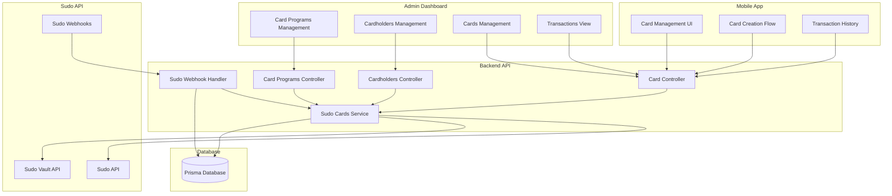

# Sudo Cards API Integration Plan

## Overview

We are implementing the **Sudo Cards API** integration across the entire RaverPay platform. Sudo provides card issuing infrastructure that enables:

- **Card Programs**: Centralized configuration for batches of cards (created manually via Sudo Dashboard)
- **Cardholders**: Individual or business entities that can be issued cards
- **Cards**: Virtual and physical payment cards (Verve, Visa, MasterCard, AfriGo)
- **Spending Controls**: Limits, merchant categories, channel restrictions
- **Funding Sources**: Default (wallet), Account (settlement), Gateway (JIT with webhooks)
- **Real-time Authorizations**: Webhook-based transaction approval/decline
- **Transaction Management**: Authorizations, transactions, refunds, disputes

**Note**: Card programs will be created manually via the Sudo Dashboard. After creation, the program ID will be stored in our database for use when creating cards via API.

## Architecture Overview



## Implementation Tasks

### Phase 1: Backend API Foundation

#### 1.1 Database Schema (`apps/raverpay-api/prisma/schema.prisma`)

- Add `SudoCardProgram` model (id, sudoProgramId, name, reference, description, createdAt, updatedAt) - stores program ID from Sudo Dashboard for reference
- Add `SudoCardholder` model (id, userId, sudoCustomerId, type, name, status, individual, business, billingAddress, kycDetails, createdAt, updatedAt)
- Add `SudoCard` model (id, userId, cardholderId, programId, sudoCardId, type, brand, currency, maskedPan, expiryMonth, expiryYear, status, spendingControls, fundingSourceId, metadata, createdAt, updatedAt)
- Add `SudoAuthorization` model (id, cardId, sudoAuthorizationId, amount, fee, vat, currency, status, approved, merchantAmount, merchantCurrency, merchant, terminal, transactionMetadata, verification, createdAt, updatedAt)
- Add `SudoTransaction` model (id, authorizationId, cardId, sudoTransactionId, amount, fee, vat, currency, type, status, merchantAmount, merchantCurrency, createdAt, updatedAt)
- Add `SudoFee` model (id, cardId, transactionId, feeType, sudoCost, markup, userCharge, currency, paidBy, description, createdAt) - track Sudo costs, RaverPay markup, and user charges
- Add `SudoCost` model (id, feeType, cardBrand, currency, costType, costValue, isActive, createdAt, updatedAt, updatedBy) - stores Sudo's base costs (from pricing doc)
  - feeType: CARD_CREATION, CARD_FUNDING, AUTHORIZATION, ATM_WITHDRAWAL, DISPUTE, QUARTERLY_MAINTENANCE
  - cardBrand: VERVE, MASTERCARD, VISA, AFRIGO
  - currency: NGN, USD
  - costType: PERCENTAGE, FIXED (e.g., 1.5% for Mastercard funding, or ₦50 fixed for Verve card creation)
  - costValue: Decimal (percentage or fixed amount)
  - isActive: Boolean (can disable without deleting)
- Add `SudoFeeConfig` model (id, feeType, cardBrand, currency, markupType, markupValue, isActive, createdAt, updatedAt, updatedBy) - configurable RaverPay markup rates
  - feeType: CARD_CREATION, CARD_FUNDING, AUTHORIZATION, ATM_WITHDRAWAL, DISPUTE, QUARTERLY_MAINTENANCE
  - cardBrand: VERVE, MASTERCARD, VISA, AFRIGO
  - currency: NGN, USD
  - markupType: PERCENTAGE, FIXED
  - markupValue: Decimal (percentage or fixed amount)
  - isActive: Boolean (can disable configurations without deleting)
- Extend `ExchangeRate` model to support NGN → USD conversions (currently only USD → NGN exists)
- Ensure USD wallet creation logic (WalletType.USD already exists in enum)
- Add indexes for foreign keys and common queries
- Create seed file (`apps/raverpay-api/prisma/seed.ts`) - add `seedSudoCosts()` function
  - Seed initial Sudo costs from pricing document:
    - Verve NGN: Card Creation (₦50), Authorization (₦5), ATM (₦35), Dispute (₦100), Quarterly Maintenance (₦50)
    - Verve USD: Card Creation ($0.10), Authorization ($0.01), ATM ($0.07), Dispute ($0.20), Quarterly Maintenance ($0.07)
    - Mastercard/Visa USD: Card Creation ($1.00), Funding (1.5%), Dispute ($50.00)
    - All costs stored as FIXED or PERCENTAGE in `SudoCost` model

#### 1.2 Sudo Service (`apps/raverpay-api/src/sudo/`)

- Create `sudo.module.ts` (NestJS module)
- Create `sudo.service.ts` (main service with axios client, base URL configuration, OAuth token management)
- Create `sudo.types.ts` (TypeScript interfaces for all Sudo API request/response types)
- ~~Create `sudo-card-programs.service.ts`~~ - **REMOVED**: Card programs created manually via Sudo Dashboard
- Create `sudo-cardholders.service.ts` (cardholder CRUD operations)
- Create `sudo-cards.service.ts` (card CRUD, freeze/unfreeze, terminate, update spending controls, fund card)
- Create `sudo-authorizations.service.ts` (fetch authorizations, simulate authorization for testing)
- Create `sudo-transactions.service.ts` (fetch transactions, get transaction details)
- Create `sudo-vault.service.ts` (vault endpoint for retrieving sensitive card data)
- Create `sudo-fee.service.ts` (calculate and track fees - card creation, funding, transactions)
  - Methods:
    - `getSudoCost(feeType, brand, currency, amount?)` - Get Sudo's cost from `SudoCost` database
    - `calculateSudoCost(feeType, brand, currency, amount?)` - Calculate Sudo cost (handles percentage/fixed, applies to amount if needed)
    - `getMarkupConfig(feeType, brand, currency)` - Get markup configuration from `SudoFeeConfig` database
    - `calculateUserCharge(sudoCost, markupType, markupValue)` - Apply markup (percentage or fixed)
    - `calculateFee(feeType, brand, currency, amount?)` - Main method: Returns {sudoCost, markup, userCharge, breakdown}
    - `calculateCardCreationFee(brand, currency)` - Returns {sudoCost, markup, userCharge}
    - `calculateAuthorizationFee(brand, currency)` - Returns {sudoCost, markup, userCharge}
    - `calculateAtmFee(brand, currency)` - Returns {sudoCost, markup, userCharge}
    - `calculateFundingFee(brand, currency, amount)` - Returns {sudoCost, markup, userCharge}
    - **Sudo Cost Management (admin)**:
      - `getAllSudoCosts()` - Get all Sudo cost configurations
      - `getSudoCost(id)` - Get specific Sudo cost
      - `createSudoCost(data)` - Create Sudo cost configuration
      - `updateSudoCost(id, data)` - Update Sudo cost configuration
      - `deleteSudoCost(id)` - Delete Sudo cost (soft delete)
    - **Markup Management (admin)**:
      - `getAllFeeConfigs()` - Get all markup configurations
      - `createFeeConfig(data)` - Create markup configuration
      - `updateFeeConfig(id, data)` - Update markup configuration
      - `deleteFeeConfig(id)` - Delete markup configuration (soft delete)
    - `getFeeStats()` - Get fee statistics (revenue, costs) (admin)
    - `recordFee(feeData)` - Record in SudoFee model
  - Calculate Sudo cost from `SudoCost` database (not hardcoded)
  - Apply RaverPay markup from `SudoFeeConfig` database (percentage or fixed amount)
  - Calculate user charge = Sudo cost + markup
  - Track both: Sudo cost (paid by RaverPay) and user charge (revenue)
  - Record in SudoFee model with breakdown (sudoCost, markup, userCharge, paidBy)
- Create `currency-conversion.service.ts` (NGN → USD conversion for USD card funding)
  - Methods: `getConversionQuote()`, `executeConversion()`
  - Uses existing ExchangeRate service (extend to support NGN → USD)
  - Similar pattern to crypto conversion service
  - Deduct NGN from NGN wallet, credit USD to USD wallet
- Environment variables: `SUDO_API_KEY`, `SUDO_BASE_URL` (sandbox/production), `SUDO_VAULT_ID`

#### 1.3 Controllers (`apps/raverpay-api/src/sudo/`)

- ~~Create `card-programs.controller.ts`~~ - **REMOVED**: Card programs created manually via Sudo Dashboard. Program IDs will be stored in database after manual creation.
- Create `cardholders.controller.ts` (POST /api/sudo/cardholders, GET /api/sudo/cardholders, GET /api/sudo/cardholders/:id, PUT /api/sudo/cardholders/:id)
- Create `cards.controller.ts` (POST /api/sudo/cards, GET /api/sudo/cards, GET /api/sudo/cards/:id, PUT /api/sudo/cards/:id, POST /api/sudo/cards/:id/freeze, POST /api/sudo/cards/:id/unfreeze, POST /api/sudo/cards/:id/terminate, POST /api/sudo/cards/:id/fund, GET /api/sudo/cards/:id/authorizations, GET /api/sudo/cards/:id/transactions)
  - Card creation: Calculate Sudo cost, apply markup, charge user (Sudo cost + markup), deduct from user wallet, Sudo cost will be charged to RaverPay from Sudo dashboard, record in SudoFee
  - Card funding: Check wallet balance (NGN or USD based on card currency), calculate Sudo funding fee, apply markup, charge user (Sudo cost + markup), deduct from user wallet, Sudo cost will be charged to RaverPay from Sudo dashboard, record in SudoFee
- Create `sudo-fees.controller.ts` (Fee configuration and calculation endpoints)
  - **Public endpoints** (for mobile app to display fees - no auth required):
    - GET /api/sudo/fees/calculate - Calculate fee for a specific action
      - Query params: `feeType` (CARD_CREATION|CARD_FUNDING|AUTHORIZATION|ATM_WITHDRAWAL), `cardBrand` (VERVE|MASTERCARD|VISA|AFRIGO), `currency` (NGN|USD), `amount` (optional, required for funding)
      - Returns: `{sudoCost, markup, userCharge, breakdown: {feeType, cardBrand, currency, sudoCost, sudoCostType, sudoCostValue, markupType, markupValue, markup, userCharge}}`
    - GET /api/sudo/fees/quote/card-creation - Get card creation fee quote
      - Query params: `cardBrand`, `currency`
      - Returns: Same structure as calculate endpoint
    - GET /api/sudo/fees/quote/funding - Get funding fee quote
      - Query params: `cardBrand`, `currency`, `amount` (required)
      - Returns: Same structure as calculate endpoint
  - **Admin endpoints** (for managing fee configurations - requires admin role):
    - **Sudo Cost Management**:
      - GET /api/admin/sudo/costs - Get all Sudo cost configurations (with pagination, filters)
      - GET /api/admin/sudo/costs/:id - Get specific Sudo cost configuration
      - POST /api/admin/sudo/costs - Create new Sudo cost configuration
        - Body: `{feeType, cardBrand, currency, costType, costValue, isActive}`
      - PUT /api/admin/sudo/costs/:id - Update Sudo cost configuration
      - DELETE /api/admin/sudo/costs/:id - Delete Sudo cost (soft delete by setting isActive=false)
    - **Markup Configuration Management**:
      - GET /api/admin/sudo/fees/config - Get all markup configurations (with pagination, filters)
      - GET /api/admin/sudo/fees/config/:id - Get specific markup configuration
      - POST /api/admin/sudo/fees/config - Create new markup configuration
        - Body: `{feeType, cardBrand, currency, markupType, markupValue, isActive}`
      - PUT /api/admin/sudo/fees/config/:id - Update markup configuration
      - DELETE /api/admin/sudo/fees/config/:id - Delete markup configuration (soft delete by setting isActive=false)
    - **Statistics**:
      - GET /api/admin/sudo/fees/stats - Get fee statistics (revenue from markups, costs paid to Sudo, net profit)
        - Query params: `startDate`, `endDate`, `groupBy` (feeType|cardBrand|currency)
- Create `currency-conversion.controller.ts` (POST /api/sudo/convert/ngn-to-usd/quote - get quote, POST /api/sudo/convert/ngn-to-usd/execute - execute conversion)
  - Quote endpoint: Show NGN amount, exchange rate, platform fee, USD amount
  - Execute endpoint: Verify PIN, lock wallets, perform conversion, create transaction records
- Create `sudo-webhook.controller.ts` (POST /api/webhooks/sudo) - handle authorization.request, transaction.created, authorization.declined, transaction.refund, card.balance, card.terminated
- Create `sudo-webhook.service.ts` (process webhook events, update database, trigger notifications)

#### 1.4 DTOs (`apps/raverpay-api/src/sudo/dto/`)

- Create DTOs for all request/response types using class-validator
- ~~Card program DTOs~~ - **REMOVED**: Not needed as programs created manually
- Cardholder DTOs (CreateCardholderDto, UpdateCardholderDto)
- Card DTOs (CreateCardDto, UpdateCardDto, FreezeCardDto, UpdateSpendingControlsDto, FundCardDto)
- Currency Conversion DTOs (GetConversionQuoteDto, ExecuteConversionDto)
- Fee DTOs (CalculateFeeDto, GetFeeQuoteDto, CreateSudoCostDto, UpdateSudoCostDto, CreateFeeConfigDto, UpdateFeeConfigDto)
- Authorization DTOs (SimulateAuthorizationDto)
- Webhook DTOs (AuthorizationRequestDto, TransactionCreatedDto, etc.)

#### 1.5 Integration Points

- Link cards to users (userId foreign key)
- Link cards to wallets for funding (NGN cards → NGN wallet, USD cards → USD wallet)
- Create transactions in existing Transaction model for card transactions
- **Fee Management**:
  - Sudo costs stored in `SudoCost` database (admin-configurable, seeded from pricing doc)
  - Markup configurations stored in `SudoFeeConfig` database (admin-configurable)
  - Public API endpoint for mobile app to fetch fee quotes before card creation/funding
  - Admin API endpoints for managing both Sudo costs and markup configurations
  - Calculate user charges: Sudo cost (from `SudoCost` DB) + RaverPay markup (from `SudoFeeConfig` DB)
  - Deduct user charges from user wallet (Sudo cost + markup)
  - Sudo costs are charged to RaverPay from Sudo dashboard (not via API - handled by Sudo)
  - Track both Sudo costs and user charges in SudoFee model (with markup breakdown)
  - Record revenue (markup) separately for accounting
  - Note: Monthly platform access fees and quarterly maintenance fees are NOT charged to users - RaverPay pays these directly
- Create USD wallet automatically when user requests USD card (if doesn't exist) - use existing wallet creation logic
- Integrate with existing ExchangeRate service for NGN → USD conversions
- Ensure wallet balance checks before card funding (NGN wallet for NGN cards, USD wallet for USD cards)
- Handle insufficient balance scenarios (show error for NGN cards, prompt conversion for USD cards)
- Send notifications for card events (card created, frozen, transaction declined, etc.)
- Add RBAC guards for admin endpoints (fee config management)
- Handle fee calculations based on card brand and currency (with configurable markups)

### Phase 2: Admin Dashboard

#### 2.1 API Client (`apps/raverpay-admin/lib/api/sudo.ts`)

- Create API functions following existing pattern (admins.ts, crypto.ts)
- Functions:
  - Sudo Cost Management (admin only): `getSudoCosts`, `getSudoCost`, `createSudoCost`, `updateSudoCost`, `deleteSudoCost`
  - Markup Configuration (admin only): `getFeeConfigs`, `getFeeConfig`, `createFeeConfig`, `updateFeeConfig`, `deleteFeeConfig`
  - Statistics: `getFeeStats`
  - Cardholders: `getCardholders`, `createCardholder`, `getCardholder`, `updateCardholder`
  - Cards: `getCards`, `createCard`, `getCard`, `updateCard`, `freezeCard`, `unfreezeCard`, `terminateCard`, `updateSpendingControls`, `fundCard`
  - Transactions: `getAuthorizations`, `getTransactions`
- Use existing `apiClient` from `api-client.ts`
- **Note**: Card programs are created manually via Sudo Dashboard. Program IDs are stored in database for reference when creating cards.

#### 2.2 Pages (`apps/raverpay-admin/app/dashboard/`)

- Create `sudo/` directory
- ~~`sudo/card-programs/page.tsx`~~ - **REMOVED**: Card programs created manually via Sudo Dashboard
- `sudo/costs/page.tsx` - Manage Sudo cost configurations (base costs from Sudo pricing)
- `sudo/costs/[costId]/page.tsx` - Edit specific Sudo cost configuration
- `sudo/fees/page.tsx` - Manage RaverPay markup configurations (markup rates for different fee types, card brands, currencies)
- `sudo/fees/[configId]/page.tsx` - Edit specific markup configuration
- `sudo/cardholders/page.tsx` - List and create cardholders
- `sudo/cards/page.tsx` - List all cards with filters (status, type, cardholder)
- `sudo/cards/[cardId]/page.tsx` - Card details, transactions, authorizations, spending controls management
- `sudo/transactions/page.tsx` - List all card transactions with filters
- `sudo/authorizations/page.tsx` - List all authorizations (pending, approved, declined)

#### 2.3 Components (`apps/raverpay-admin/components/sudo/`)

- ~~`CardProgramForm.tsx`~~ - **REMOVED**: Not needed
- `SudoCostForm.tsx` - Form for creating/editing Sudo cost configurations (base costs)
- `SudoCostTable.tsx` - Table displaying all Sudo cost configurations with filters
- `FeeConfigForm.tsx` - Form for creating/editing markup configurations
- `FeeConfigTable.tsx` - Table displaying all markup configurations with filters
- `FeeStats.tsx` - Display fee statistics (revenue from markups, costs paid to Sudo, net profit)
- `CardholderForm.tsx` - Form for creating/editing cardholders
- `CardForm.tsx` - Form for creating cards
- `SpendingControlsForm.tsx` - Form for updating spending controls
- `CardDetails.tsx` - Card information display
- `CardTransactionsTable.tsx` - Table for displaying card transactions
- `CardAuthorizationsTable.tsx` - Table for displaying authorizations
- `CardStatusBadge.tsx` - Status badge component

#### 2.4 Navigation

- Add "Sudo Cards" section to sidebar (`components/dashboard/sidebar.tsx`)
- Sub-items: Sudo Costs, Fee Configuration (Markups), Cardholders, Cards, Transactions, Authorizations
- **Note**: Card Programs managed via Sudo Dashboard (link can be added if needed)

### Phase 3: Mobile App

#### 3.1 API Service (`apps/raverpaymobile/src/services/sudo.service.ts`)

- Create service following pattern from `crypto.service.ts`, `support.service.ts`
- Functions:
  - Fee Calculation: `getCardCreationFee(brand, currency)`, `getFundingFeeQuote(brand, currency, amount)`, `calculateFee(feeType, brand, currency, amount?)`
  - Cards: `getCards`, `createCard`, `getCardDetails`, `freezeCard`, `unfreezeCard`, `terminateCard`, `updateSpendingControls`, `fundCard`, `getCardTransactions`, `getCardAuthorizations`, `getCardToken` (for Secure Proxy)
- Use existing `apiClient` from `lib/api/client.ts`
- **Note**: Fee calculation endpoints are public (no auth required) for displaying fees before card creation/funding

#### 3.2 Types (`apps/raverpaymobile/src/types/sudo.types.ts`)

- Define TypeScript interfaces for all Sudo-related types
- Card, Cardholder, CardProgram, Authorization, Transaction types

#### 3.3 Hooks (`apps/raverpaymobile/src/hooks/`)

- Create `useSudoCards.ts` - React Query hooks for cards (useCards, useCreateCard, useCardDetails, useFreezeCard, etc.)
- Create `useCardTransactions.ts` - React Query hooks for transactions

#### 3.4 Screens (`apps/raverpaymobile/app/`)

- Create `(tabs)/cards/` directory structure
- `(tabs)/cards/index.tsx` - List user's cards
- `(tabs)/cards/[cardId].tsx` - Card details, transactions, controls
- `(tabs)/cards/create.tsx` - Create new card flow
  - Fetch card creation fee quote before showing form
  - Display fee breakdown (Sudo cost + RaverPay markup = total)
  - Show fee in confirmation screen
- `(tabs)/cards/[cardId]/fund.tsx` - Fund card screen (handles NGN/USD wallet checks, conversion prompts)
  - Fetch funding fee quote based on amount entered
  - Display fee breakdown before confirmation
  - Show total amount (funding + fee) user will pay
- `(tabs)/cards/[cardId]/transactions.tsx` - Card transaction history
- `(tabs)/cards/[cardId]/controls.tsx` - Spending controls management
- `(tabs)/cards/convert.tsx` - NGN → USD conversion screen (similar to crypto conversion)

#### 3.5 Components (`apps/raverpaymobile/src/components/sudo/`)

- `CardCard.tsx` - Card display component (shows masked PAN, expiry, status)
- `CardDetails.tsx` - Card information display
- `CardTransactionItem.tsx` - Transaction list item
- `FeeBreakdown.tsx` - Component showing fee breakdown (Sudo cost + markup = total)
- `FeeQuoteDisplay.tsx` - Display fee quote before card creation/funding
- `SpendingControlsForm.tsx` - Form for updating spending controls
- `CardActions.tsx` - Freeze/unfreeze/terminate actions
- `SecureCardData.tsx` - Component using Secure Proxy Show library for displaying sensitive card data (CVV, PIN, full card number)

#### 3.6 Store (`apps/raverpaymobile/src/store/sudo.store.ts`)

- Zustand store for card state management (if needed)
- Cache cards list, selected card, etc.

#### 3.7 Secure Proxy Integration

- Add Secure Proxy Show script to card details screen
- Implement iframe-based display for sensitive card data (CVV, PIN, card number)
- Generate card tokens via backend API

### Phase 4: Webhook Implementation

#### 4.1 Webhook Handler (`apps/raverpay-api/src/sudo/sudo-webhook.service.ts`)

- Handle `authorization.request` - Check balance, approve/decline, respond within 4 seconds
  - Calculate authorization fee based on card brand/currency
  - Deduct authorization fee from user wallet along with transaction amount
  - Record fee in SudoFee model
- Handle `transaction.created` - Update transaction status, notify user
  - Transaction includes authorization fee already deducted
  - Show fee breakdown in transaction details
- Handle `authorization.declined` - Log decline reason, notify user
- Handle `transaction.refund` - Process refund, update wallet balance
  - Refund includes authorization fee if applicable
- Handle `card.balance` - Return card balance from user's wallet (NGN or USD based on card currency)
- Handle `card.terminated` - Update card status, notify user

#### 4.2 Webhook Security

- Verify webhook signature (if Sudo provides)
- Validate request payload
- Handle idempotency (prevent duplicate processing)

#### 4.3 Real-time Authorization Logic

- For Gateway Funding Source: Check user wallet balance, apply spending controls, approve/decline
- For Default Funding Source: Sudo handles automatically
- For Account Funding Source: Sudo charges settlement account automatically

### Phase 5: Testing & Documentation

#### 5.1 Testing

- Unit tests for Sudo service methods
- Integration tests for webhook handlers
- E2E tests for card creation flow
- Test sandbox environment thoroughly

#### 5.2 Documentation

- API documentation for new endpoints
- Webhook setup guide
- Card program creation guide
- Mobile app card management guide

## File Structure

```
apps/raverpay-api/src/sudo/
├── sudo.module.ts
├── sudo.service.ts
├── sudo.types.ts
├── dto/
│   ├── create-cardholder.dto.ts
│   ├── create-card.dto.ts
│   ├── fund-card.dto.ts
│   ├── conversion-quote.dto.ts
│   ├── execute-conversion.dto.ts
│   └── ...
├── services/
│   ├── sudo-cardholders.service.ts
│   ├── sudo-cards.service.ts
│   ├── sudo-authorizations.service.ts
│   ├── sudo-transactions.service.ts
│   ├── sudo-vault.service.ts
│   ├── sudo-fee.service.ts
│   └── currency-conversion.service.ts
├── controllers/
│   ├── cardholders.controller.ts
│   ├── cards.controller.ts
│   ├── currency-conversion.controller.ts
│   └── sudo-webhook.controller.ts
└── sudo-webhook.service.ts

apps/raverpay-admin/
├── lib/api/sudo.ts
├── app/dashboard/sudo/
│   ├── cardholders/page.tsx
│   ├── cards/page.tsx
│   ├── cards/[cardId]/page.tsx
│   ├── transactions/page.tsx
│   └── authorizations/page.tsx
└── components/sudo/
    ├── CardholderForm.tsx
    ├── CardForm.tsx
    └── ...

apps/raverpaymobile/
├── src/services/sudo.service.ts
├── src/types/sudo.types.ts
├── src/hooks/useSudoCards.ts
├── src/components/sudo/
│   ├── CardCard.tsx
│   ├── CardDetails.tsx
│   └── ...
└── app/(tabs)/cards/
    ├── index.tsx
    ├── create.tsx
    └── [cardId].tsx
```

## Environment Variables

### Backend (`apps/raverpay-api/.env`)

```
SUDO_API_KEY=your_api_key_here
SUDO_BASE_URL=https://api.sandbox.sudo.cards  # or https://api.sudo.africa for production
SUDO_VAULT_URL=https://vault.sandbox.sudo.cards  # or https://vault.sudo.cards for production
SUDO_VAULT_ID=we0dsa28s  # or vdl2xefo5 for production
SUDO_WEBHOOK_SECRET=your_webhook_secret  # if provided by Sudo
```

### Admin Dashboard (`apps/raverpay-admin/.env.local`)

```
NEXT_PUBLIC_SUDO_VAULT_ID=we0dsa28s  # for Secure Proxy Show
```

### Mobile App (`apps/raverpaymobile/.env`)

```
EXPO_PUBLIC_SUDO_VAULT_ID=we0dsa28s  # for Secure Proxy Show
```

## Pricing & Fee Structure

### Sudo Pricing (Cost to RaverPay)

Based on Sudo pricing documentation, here are the costs:

#### Verve Cards (NGN)

- **Virtual Card Creation**: ₦50.00 per card
- **Authorization Fee**: ₦5.00 per transaction
- **Funding Fee**: FREE
- **ATM Withdrawal**: ₦35.00 per withdrawal
- **Quarterly Maintenance**: ₦50.00 per card (every 3 months)
- **Disputes**: ₦100.00 per dispute
- **Monthly Access**: ₦50,000.00 (platform infrastructure fee)

#### Verve Cards (USD)

- **Virtual Card Creation**: $0.10 per card
- **Authorization Fee**: $0.01 per transaction
- **Funding Fee**: FREE
- **ATM Withdrawal**: $0.07 per withdrawal
- **Quarterly Maintenance**: $0.07 per card (every 3 months)
- **Disputes**: $0.20 per dispute
- **Monthly Access**: $100.00 (platform infrastructure fee)

#### Mastercard/Visa Cards (USD)

- **Virtual Card Creation**: $1.00 per card
- **Authorization Fee**: FREE
- **Funding Fee**: 1.5% of funding amount
- **Quarterly Maintenance**: FREE
- **Disputes**: $50.00 per dispute
- **Monthly Access**: $500.00 (platform infrastructure fee)

### Fee Allocation Strategy

**Business Model: RaverPay charges users with markup on Sudo costs**

**What RaverPay Pays (Not Charged to Users):**

- Monthly platform access fees (infrastructure costs)
- Quarterly maintenance fees (card maintenance costs)

**What Users Pay (RaverPay charges users, Sudo charges RaverPay from dashboard):**

- Card creation fees (one-time cost) - Users pay Sudo cost + RaverPay markup
- Card funding fees (when loading money onto cards) - Users pay Sudo cost + RaverPay markup
- Authorization fees (per transaction) - Users pay Sudo cost + RaverPay markup
- ATM withdrawal fees - Users pay Sudo cost + RaverPay markup
- Dispute fees (if user initiates dispute) - Users pay Sudo cost + RaverPay markup

**Fee Flow:**

1. User pays: Sudo cost + RaverPay markup
2. RaverPay deducts total from user wallet
3. RaverPay pays Sudo cost to Sudo (charged from Sudo dashboard)
4. RaverPay keeps markup as revenue

## USD Wallet & Currency Conversion

### USD Wallet Support

**Current State:**

- USD wallet type already exists in `WalletType` enum
- Users can have multiple wallets: NGN, USD, CRYPTO

**Implementation Required:**

- Ensure USD wallet is created automatically when user requests USD card
- USD wallet follows same structure as NGN wallet (balance, ledgerBalance, etc.)

### NGN → USD Conversion

**Requirement:**

- Users must convert NGN to USD before funding USD cards
- Conversion uses exchange rate system (similar to crypto conversion)
- Exchange rates managed by admins (USD → NGN rate already exists, need reverse: NGN → USD)

**Conversion Flow:**

1. User wants to fund USD card
2. Check if user has USD wallet (create if not)
3. Check USD wallet balance
4. If insufficient, user must convert NGN → USD first
5. Show conversion quote (NGN amount, exchange rate, fee, USD amount)
6. User confirms conversion
7. Deduct NGN from NGN wallet, credit USD to USD wallet
8. User can then fund card from USD wallet

**Exchange Rate Management:**

- Extend existing `ExchangeRate` model to support NGN → USD conversions
- Admin sets NGN/USD rate (can derive from USD/NGN rate: 1 / rate, or set independently)
- Platform fee percentage for conversions (similar to crypto conversions, e.g., 1-2%)
- Exchange rate service already exists - extend `ExchangeRateService` to support NGN → USD
- Use same pattern as crypto conversion (quote → execute flow)

### Card Funding Flows

#### NGN Card Funding

1. User selects NGN card
2. User enters funding amount
3. Check NGN wallet balance
4. If sufficient: Deduct from NGN wallet → Fund card (RaverPay pays funding fee)
5. If insufficient: Show error, prompt to add funds to NGN wallet

#### USD Card Funding

1. User selects USD card
2. User enters funding amount (in USD)
3. Check USD wallet balance
4. If sufficient: Deduct from USD wallet → Fund card (RaverPay pays funding fee)
5. If insufficient:
   - Show conversion prompt
   - User converts NGN → USD
   - After conversion, proceed with funding

## Key Considerations

1. **PCI Compliance**: Sensitive card data (CVV, PIN, full card number) must only be retrieved via Vault API and displayed using Secure Proxy Show library
2. **Webhook Timeout**: Authorization requests must be responded to within 4 seconds
3. **Idempotency**: All card creation and updates should be idempotent
4. **Error Handling**: Comprehensive error handling for API failures, webhook processing errors
5. **Rate Limiting**: Respect Sudo API rate limits
6. **Testing**: Thoroughly test in sandbox before production
7. **Security**: Store API keys securely, verify webhook signatures
8. **User Experience**: Clear error messages, loading states, success notifications
9. **Fee Transparency**: Show all fees clearly before transactions
10. **Currency Conversion**: Handle NGN → USD conversions with proper exchange rates and fees
11. **Wallet Management**: Ensure USD wallets are created automatically when needed
12. **Cost Tracking**: Track Sudo fees paid by RaverPay for accounting purposes

## Dependencies

### Backend

- axios (already installed)
- @nestjs/common, @nestjs/core (already installed)

### Admin Dashboard

- No new dependencies needed (uses existing React Query, axios)

### Mobile App

- No new dependencies needed (uses existing React Query, axios)
- Secure Proxy Show library (loaded via script tag in WebView)

## User-Facing Features

### Admin Dashboard Capabilities

#### Sudo Cost Management

**What admins can do:**

- **View All Sudo Costs**: See all base costs from Sudo (from pricing document)
  - Filter by fee type (card creation, funding, authorization, ATM, dispute, maintenance)
  - Filter by card brand (Verve, Mastercard, Visa, AfriGo)
  - Filter by currency (NGN, USD)
  - See active/inactive status

- **Create Sudo Cost Configuration**: Add new Sudo cost entry
  - Select fee type, card brand, currency
  - Choose cost type (percentage or fixed amount)
  - Enter cost value
  - Set active status

- **Edit Sudo Cost Configuration**: Update Sudo costs when pricing changes
  - Change cost type or value
  - Enable/disable configurations
  - Updates affect all future fee calculations

**How it works:**

- Initial Sudo costs seeded from pricing document
- Admins can update costs when Sudo changes pricing (no code deployment needed)
- Costs stored in database, read by fee calculation service
- Changes take effect immediately for new transactions

#### Fee Configuration Management (Markups)

**Note**: Card programs are created manually via the Sudo Dashboard. After creation, the program ID is stored in our database for use when creating cards via API.

**What admins need to do:**

- **Create Card Programs** (via Sudo Dashboard): Set up templates for issuing cards with predefined settings
  - See "Card Program Setup" section below for detailed information needed
  - Program IDs are stored in database after manual creation
  - Programs can be viewed/edited directly in Sudo Dashboard

**Card Program Information Required:**

- Name, Unique Reference, Description
- Funding Source (default/account/gateway)
- Card Brand (Verve/Visa/MasterCard/AfriGo)
- Card Type (Virtual/Physical)
- Issuer Country, Currency
- Debit Account (settlement account)
- Spending Controls (channels, categories, limits)

#### Cardholders Management

**What admins can do:**

- **Create Cardholders**: Register individuals or businesses who can receive cards
  - Enter personal/business information (name, address, phone, email)
  - Add KYC details (BVN, NIN, identity documents)
  - Set cardholder status (active, suspended, inactive)
  - Link to RaverPay user account

- **View All Cardholders**: Browse all registered cardholders with filters
- **View Cardholder Details**: See full profile, billing address, KYC status, and all cards issued to them
- **Update Cardholder Information**: Edit details, update KYC information, change status
- **Cardholder History**: View all transactions and authorizations for a specific cardholder

#### Cards Management

**What admins can do:**

- **View All Cards**: See every card issued across the platform
  - Filter by status (active, frozen, terminated, canceled)
  - Filter by type (virtual, physical)
  - Filter by cardholder
  - Filter by card program
  - Search by card number (masked)

- **View Card Details**: Access comprehensive card information
  - Card number (masked), expiry date, CVV (via secure display)
  - Current balance and spending limits
  - Spending controls (channels, categories, limits)
  - Cardholder information
  - Funding source details
  - Card status and history

- **Create Cards**: Issue new cards to cardholders
  - Select cardholder
  - Choose card program (or create standalone card)
  - Set initial spending controls
  - Choose card type (virtual or physical)
  - For physical cards: enter card number if mapping existing card

- **Manage Card Status**:
  - **Freeze Card**: Temporarily block a card from being used (e.g., if lost or suspicious activity)
  - **Unfreeze Card**: Reactivate a frozen card
  - **Terminate Card**: Permanently cancel a card (cannot be reactivated)

- **Update Spending Controls**: Modify card limits and restrictions
  - Change daily/monthly/per-transaction limits
  - Allow or block specific merchant categories
  - Enable/disable channels (ATM, POS, Web, Mobile)
  - Set category-specific limits (e.g., limit spending at restaurants to NGN 5,000/day)

- **View Card Transactions**: See all transactions for a specific card
  - Transaction history with dates, amounts, merchants
  - Transaction status (approved, declined, pending)
  - Merchant information (name, category, location)
  - Terminal details (for POS/ATM transactions)

- **View Card Authorizations**: Monitor authorization attempts
  - See all authorization requests (approved and declined)
  - View decline reasons (insufficient funds, spending limit exceeded, blocked category, etc.)
  - Monitor pending authorizations
  - Review fraud detection flags

#### Transactions & Authorizations Overview

**What admins can do:**

- **View All Card Transactions**: Monitor all card transactions across the platform
  - Filter by date range, card, cardholder, status, merchant category
  - See transaction amounts, fees, and net amounts
  - View refunds and reversals
  - Export transaction data

- **View All Authorizations**: Monitor all authorization attempts
  - See real-time authorization requests
  - View approval/decline rates
  - Monitor authorization response times
  - Identify patterns (fraud, declined transactions, etc.)

- **Transaction Details**: Drill down into specific transactions
  - Full transaction information
  - Related authorization details
  - Merchant and terminal information
  - Verification data (CVV match, PIN match, 3D Secure, etc.)

#### Real-Time Monitoring

**What admins can do:**

- **Live Authorization Feed**: See authorization requests as they happen
- **Decline Alerts**: Get notified when transactions are declined (with reasons)
- **Fraud Detection**: View transactions flagged as suspicious by Sudo's fraud system
- **Balance Monitoring**: Check card balances and wallet balances
- **Webhook Status**: Monitor webhook delivery status and retry attempts

### Mobile App User Capabilities

#### Card Management

**What users can do:**

- **View My Cards**: See all their cards in one place
  - Card display showing masked card number (e.g., 5063 21** \*\*** 3531)
  - Card brand logo (Verve, Visa, MasterCard, AfriGo)
  - Expiry date
  - Current status (Active, Frozen, Terminated)
  - Available balance (if using default funding source)
  - Quick actions (Freeze, View Details, View Transactions)

- **Create New Card**: Request a new virtual or physical card
  - Select card program (if multiple available)
  - Choose card type (virtual or physical)
  - Set initial spending limits (optional)
  - Confirm creation
  - View card details immediately (for virtual cards)

- **View Card Details**: Access full card information
  - Full card number (displayed securely via Secure Proxy - PCI compliant)
  - CVV (displayed securely)
  - Expiry date
  - Card PIN (default PIN, securely displayed)
  - Current spending limits
  - Spending controls settings
  - Card status

- **Card Actions**:
  - **Freeze Card**: Temporarily block card if lost or stolen
  - **Unfreeze Card**: Reactivate a frozen card
  - **Terminate Card**: Permanently cancel a card
  - **Copy Card Details**: Copy card number, CVV, or PIN (for secure use)

#### Spending Controls Management

**What users can do:**

- **View Current Limits**: See all spending controls on their card
  - Daily spending limit
  - Monthly spending limit
  - Per-transaction limit
  - Category-specific limits
  - Channel restrictions (ATM, POS, Web, Mobile)

- **Update Spending Limits**: Modify their card limits
  - Increase or decrease daily/monthly limits
  - Set per-transaction maximum
  - Adjust category-specific limits
  - Enable/disable channels (e.g., disable ATM withdrawals)

- **Block Merchant Categories**: Prevent card from being used at specific merchant types
  - Select categories to block (e.g., gambling, adult entertainment)
  - View currently blocked categories
  - Remove blocks

- **Set Allowed Categories Only**: Restrict card to specific merchant types
  - Choose allowed categories (e.g., only groceries and restaurants)
  - All other categories automatically blocked

#### Transaction History

**What users can do:**

- **View Card Transactions**: See all transactions for a specific card
  - Transaction list with dates and amounts
  - Merchant names and locations
  - Transaction status (approved, declined, pending)
  - Transaction type (purchase, withdrawal, refund)
  - Filter by date range, status, merchant category

- **Transaction Details**: View detailed information about a transaction
  - Full transaction amount and fees
  - Merchant information (name, category, location)
  - Transaction reference number
  - Authorization details
  - Terminal information (for POS/ATM transactions)
  - Transaction timestamp

- **View Declined Transactions**: See why transactions were declined
  - Decline reason (insufficient funds, limit exceeded, blocked category, etc.)
  - Transaction attempt details
  - Suggestions on how to resolve (e.g., "Increase your daily limit")

#### Real-Time Notifications

**What users receive:**

- **Transaction Alerts**: Get notified when card is used
  - Transaction amount and merchant
  - Transaction location (if available)
  - Approval or decline status

- **Card Status Updates**: Notifications for card events
  - Card created successfully
  - Card frozen/unfrozen
  - Card terminated
  - Spending limits updated
  - Low balance warnings

- **Security Alerts**: Notifications for security events
  - Suspicious transaction attempts
  - Multiple declined transactions
  - Card frozen due to fraud detection
  - Unusual spending patterns

#### Card Usage

**What users can do with their cards:**

- **Use Virtual Cards Online**:
  - Copy card details (number, CVV, expiry) for online purchases
  - Use card at any merchant that accepts the card brand
  - View transaction immediately after purchase

- **Use Physical Cards**:
  - Use at ATMs for cash withdrawals
  - Use at POS terminals for in-store purchases
  - Use online with card details

- **Monitor Spending**:
  - Track spending against limits
  - View spending by category
  - See spending trends over time
  - Get alerts when approaching limits

### Key User Benefits

#### For Admins:

1. **Centralized Management**: Control all cards, cardholders, and programs from one dashboard
2. **Real-Time Monitoring**: See transactions and authorizations as they happen
3. **Fraud Prevention**: Monitor suspicious activity and freeze cards instantly
4. **Flexible Controls**: Set granular spending limits and restrictions
5. **Comprehensive Analytics**: Track card usage, spending patterns, and program performance
6. **Quick Actions**: Freeze, unfreeze, or terminate cards with one click
7. **Audit Trail**: Complete history of all card actions and transactions

#### For End Users:

1. **Instant Card Creation**: Get virtual cards immediately after request
2. **Full Control**: Manage spending limits and restrictions themselves
3. **Security**: Freeze cards instantly if lost or stolen
4. **Transparency**: See all transactions in real-time with detailed information
5. **Convenience**: Use cards online and in-store (for physical cards)
6. **Notifications**: Stay informed about all card activity
7. **Easy Management**: Simple interface to manage multiple cards

### User Flows

#### Admin Flow: Creating and Issuing a Card

1. Admin selects card program (programs created manually in Sudo Dashboard, IDs stored in database)
2. Admin creates a cardholder (or selects existing one)
3. Admin creates a card linked to the cardholder and program (using stored program ID)
4. Card is immediately available to the user
5. Admin can monitor card usage and transactions
6. Admin can freeze/unfreeze or terminate card as needed

#### User Flow: Creating and Using a Card

1. User opens mobile app and navigates to Cards section
2. User taps "Create New Card"
3. User selects card program and type (virtual/physical)
4. User sets spending limits (optional)
5. Card is created instantly (for virtual cards)
6. User views card details (number, CVV, PIN)
7. User uses card for online purchases or in-store (physical)
8. User receives notifications for each transaction
9. User can view transaction history and manage spending controls

#### User Flow: Managing Spending Controls

1. User opens card details
2. User navigates to "Spending Controls"
3. User views current limits
4. User updates daily/monthly limits or blocks categories
5. Changes take effect immediately
6. User receives confirmation notification

## Card Program Setup (Manual via Sudo Dashboard)

Before implementing the integration, you need to create card programs in the Sudo Dashboard. Here's what you need to prepare:

### Information Required for Card Program Creation

1. **Name**: A descriptive name for your card program (e.g., "RaverPay Virtual Cards", "Employee Expense Cards")

2. **Unique Reference**: A unique identifier for the program (e.g., "RVRP-VIRTUAL-001" or generate timestamp-based reference)

3. **Description** (Optional): Additional details about the program

4. **Funding Source**: Choose one of:
   - Default funding source (funds from customer wallet)
   - Account funding source (funds from your settlement account)
   - Gateway funding source (real-time approval via webhook - requires webhook URL)

5. **Card Brand**: Select from:
   - Verve
   - Visa (virtual only)
   - MasterCard (virtual only)
   - AfriGo

6. **Card Type**:
   - Virtual Card (for online use)
   - Physical Card (for ATM/POS use - requires card mapping)

7. **Issuer Country**: Nigeria (NGA)

8. **Currency**: NGN (or USD if applicable)

9. **Debit Account**: Your settlement account ID (must be created first in Sudo Dashboard)

10. **Spending Controls** (Optional but recommended):
    - **Channels**: Enable/disable ATM, POS, Web, Mobile
    - **Allowed Categories**: Specific merchant categories to allow (empty = all allowed)
    - **Blocked Categories**: Merchant categories to block
    - **Spending Limits**:
      - Amount (e.g., 100000 for NGN 100,000)
      - Interval: daily, weekly, monthly, yearly, per_authorization, all_time
      - Categories: Specific categories this limit applies to (empty = all categories)

### Steps to Create Card Program

1. Log in to Sudo Dashboard: https://app.sandbox.sudo.cards (sandbox) or https://app.sudo.africa (production)
2. Navigate to Card Programs section
3. Click "Create Card Program"
4. Fill in all required fields
5. Configure spending controls as needed
6. Save the program
7. **Copy the Program ID** - This will be stored in our database for use when creating cards

### After Creating Card Programs

- Store the Program ID(s) in your database (we'll add a `SudoCardProgram` model to store these)
- Use the Program ID when creating cards via API (in the `programId` field)
- Program settings can be updated later in Sudo Dashboard if needed

## Migration Strategy

1. **Pre-Implementation**: Create card programs in Sudo Dashboard and store program IDs
2. Start with sandbox environment
3. Implement backend API first
4. Test webhooks locally using ngrok or similar
5. Implement admin dashboard
6. Implement mobile app
7. Test end-to-end flows
8. Migrate to production after thorough testing
